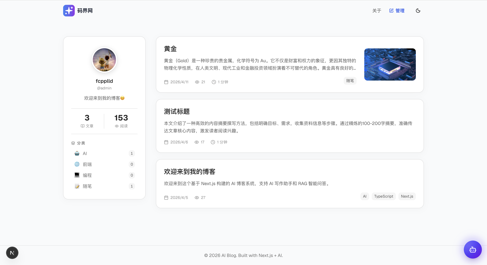
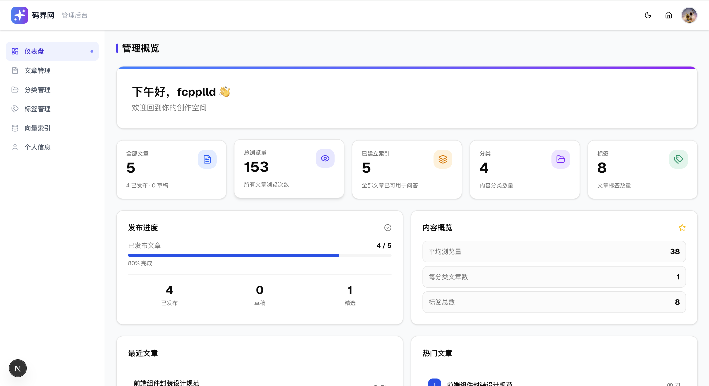
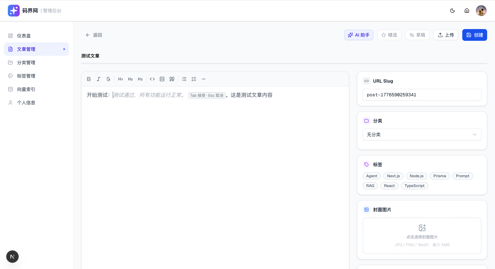
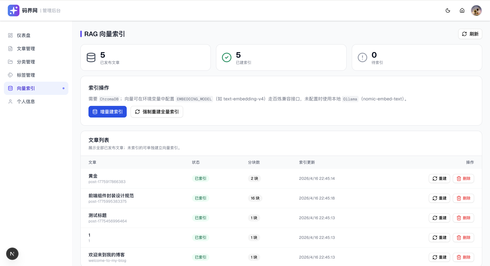

# Next AI Blog CMS

基于 **Next.js App Router** 的博客与后台一体化项目：公开前台、管理员 CMS、AI 写作助手，以及基于向量检索（RAG）的站内智能问答。

---

## 功能预览

以下为项目主要界面截图（资源位于仓库 `public/`），便于快速了解博客前台、后台 CMS、向量与 RAG 能力。

### 博客前台

访客端首页：文章列表、分类与阅读入口。



### 管理后台

登录后的管理总览：快捷入口与内容管理。



### 文章编辑（CMS）

后台撰写与编辑文章，集成 Markdown / 富文本与 AI 辅助写作。



### 向量管理

文章块嵌入与向量索引管理（需配置 Ollama、ChromaDB 等）。



### RAG 智能问答

基于站内文章检索的对话式问答（流式输出）。


---

## 技术栈

### 核心运行时

| 类别 | 技术 | 说明 |
|------|------|------|
| 框架 | **Next.js 16.2** | App Router、服务端组件与 Route Handlers |
| UI 库 | **React 19** | 客户端交互与组件 |
| 语言 | **TypeScript 5** | 全项目类型检查：`npm run type-check` |

### 样式与组件

| 类别 | 技术 | 说明 |
|------|------|------|
| CSS | **Tailwind CSS v4** | 在 `app/globals.css` 中通过 `@import "tailwindcss"` 引入，**无** `tailwind.config.ts`；主题用 `@theme inline` |
| 组件 | **shadcn/ui 风格 + Radix** | `components/ui/`，`cn()` 来自 `clsx` + `tailwind-merge` |
| 动效 | `tailwindcss-animate`、`tw-animate-css` | 过渡与动画类 |
| 排版 | `@tailwindcss/typography` | 文章 `prose` 样式 |
| 图标 | `lucide-react` | 图标集 |
| 字体 | `geist`（npm 包） | 不依赖 Google Fonts 在线加载 |

### 数据与认证

| 类别 | 技术 | 说明 |
|------|------|------|
| 数据库 | **SQLite** | 开发/单机默认，连接串见环境变量 |
| ORM | **Prisma 6** | `prisma/schema.prisma`，`postinstall` 会执行 `prisma generate` |
| 认证 | **NextAuth.js v4** | Credentials + JWT；`middleware` 保护 `/admin` 与 `/api/admin/**` |
| 密码 | `bcryptjs` | 登录密码哈希比对 |

### 内容与编辑器

| 类别 | 技术 | 说明 |
|------|------|------|
| 后台文章编辑 | **Tiptap 3** + `tiptap-markdown` | `components/admin/tiptap-editor.tsx`，Markdown 与富文本流转 |
| Markdown 展示 | `react-markdown`、`remark-gfm`、`rehype-highlight` | 前台文章渲染；代码高亮（`highlight.js`）、支持 **Mermaid** |
| 表单 / 校验 | `react-hook-form`、`zod`、`@hookform/resolvers` | 后台表单 |

### AI 与向量（可选能力）

| 类别 | 技术 | 说明 |
|------|------|------|
| 大模型 | **OpenAI 兼容对话 API** | 通过 **OpenAI 兼容 SDK**（`openai` 包）调用；密钥与地址由 `CHAT_API_KEY`、`CHAT_BASE_URL`、`CHAT_MODEL` 配置（可对接任意 OpenAI 兼容端点） |
| 嵌入向量 | **Ollama** | 默认模型如 `nomic-embed-text`，HTTP 接口由 `OLLAMA_BASE_URL` 指定 |
| 向量库 | **ChromaDB** | Node 客户端 `chromadb`，需可访问的 `CHROMADB_HOST` / `CHROMADB_PORT` |

### 其他依赖（节选）

- `next-themes`：明暗主题  
- `date-fns`：日期处理  
- `sonner`：Toast  
- `react-snowfall` 等：首页装饰效果  

---

## 环境要求

| 依赖 | 版本 / 说明 |
|------|-------------|
| **Node.js** | **20+**（与 `@types/node` 一致即可） |
| **npm** | 与 Node 配套的包管理器（文档以 `npm` 为例） |

以下为**可选**（不装则对应功能不可用或降级）：

- **`CHAT_API_KEY` 等对话配置**：AI 写作、流式对话、RAG 生成答案  
- **Ollama**：生成文章块嵌入  
- **ChromaDB**：存储与检索向量；可用 Docker 跑官方镜像  

---

## 项目启动方式

### 1. 安装依赖

```bash
npm install
```

安装结束会自动执行 `prisma generate`（`postinstall`）。

### 2. 配置环境变量

仓库根目录新建 **`.env.local`**（勿提交密钥）。数据库相关脚本通过 **dotenv-cli** 读取该文件：`dotenv -e .env.local -- …`。

**最小可运行博客 + 登录后台**所需示例：

```bash
# 数据库（SQLite 文件路径，可按需修改）
DATABASE_URL="file:./prisma/dev.db"

# NextAuth（生产环境务必使用足够长的随机密钥）
NEXTAUTH_SECRET="请替换为至少 32 字符的随机字符串"
NEXTAUTH_URL="http://localhost:3000"

# 种子数据中的管理员（与 prisma/seed 一致）
ADMIN_USERNAME="admin"
ADMIN_PASSWORD="你的安全密码"
```

**若使用 AI 写作与对话**，追加例如（以下为阿里云 **DashScope** 兼容模式示例；亦可将 `CHAT_BASE_URL` / `CHAT_MODEL` 换成其它 OpenAI 兼容服务）：

```bash
CHAT_API_KEY="你的 DashScope API Key"
CHAT_BASE_URL="https://dashscope.aliyuncs.com/compatible-mode/v1"
CHAT_MODEL="qwen3.5-flash"
```

**若使用 RAG（向量索引 + 检索问答）**，追加例如：

```bash
OLLAMA_BASE_URL="http://localhost:11434"
OLLAMA_EMBEDDING_MODEL="nomic-embed-text"

CHROMADB_HOST="localhost"
CHROMADB_PORT="8000"

# 可选：检索结果重排序（与对话类似，需兼容的重排序 API，如阿里云 DashScope）
# RAG_RERANK_API_KEY="..."
# RAG_RERANK_BASE_URL="https://dashscope.aliyuncs.com/compatible-api/v1"
# RAG_RERANK_MODEL="qwen3-rerank"
# RAG_RERANK_DISABLED=false
# RAG_RERANK_RECALL_K=10
# RAG_RERANK_TOP_K=3
```

### 3. 初始化数据库

```bash
npm run db:push   # 将 Prisma schema 同步到本地 SQLite
npm run db:seed   # 写入管理员账号与示例数据（依赖 ADMIN_*）
```

### 4.（可选）启动 RAG 依赖服务

仅在你需要 **向量嵌入 / Chroma 检索**时执行：

```bash
# Ollama：嵌入模型
ollama serve
ollama pull nomic-embed-text

# ChromaDB（示例：Docker）
docker run -d --name chromadb -p 8000:8000 chromadb/chroma:latest
```

### 5. 启动开发服务器

```bash
npm run dev
```

默认开发地址：**<http://localhost:3000>**

| 入口 | 地址 |
|------|------|
| 博客前台 | `/` |
| 管理后台 | `/admin`（使用 `ADMIN_USERNAME` / `ADMIN_PASSWORD` 登录） |
| NextAuth 登录页 | `/login` |

---

## 常用 npm 脚本

| 命令 | 作用 |
|------|------|
| `npm run dev` | 开发模式启动 Next.js |
| `npm run build` | 生产构建 |
| `npm run start` | 启动生产构建后的服务（需先 `build`） |
| `npm run lint` | ESLint |
| `npm run type-check` | `tsc --noEmit`，不生成文件 |

**数据库**（均通过 `.env.local` 加载环境）：

| 命令 | 作用 |
|------|------|
| `npm run db:generate` | 生成 Prisma Client |
| `npm run db:push` | 将 schema 推送到数据库（开发常用） |
| `npm run db:migrate` | 创建并执行迁移 |
| `npm run db:seed` | 执行种子脚本 |
| `npm run db:studio` | 打开 Prisma Studio |
| `npm run db:reset` | **清空并重建**数据库后重新 seed（破坏性操作） |

---

## 生产环境简要说明

```bash
npm run build
npm run start
```

或使用仓库中的 `ecosystem.config.js`（PM2）、`nginx.conf.template`（反向代理与 SSE 超时等）按实际服务器部署。生产环境变量可放在 `.env.production` 或由进程管理器注入，并确保 `NEXTAUTH_URL` 与公网域名一致。

---

## 目录与架构（供维护参考）

### 路径别名

TypeScript 配置中 **`@/` 指向项目根目录**（不是 `src/`），导入形如 `@/components/...`、`@/lib/...`。

### 认证与路由

- **`middleware.ts`**：配合 NextAuth `withAuth` 拦截 **`/admin/**`** 与 **`/api/admin/**`**。
- **`lib/auth.ts`**：Credentials + JWT；`authorize` 仅允许 **`role === "ADMIN"`** 的用户登录。JWT 载荷含 `id`、`username`、`role`、`displayName`。

### API 约定

- **公开接口**：`app/api/` 下如 `posts`、`categories`、`profile` 等，供前台调用。
- **管理端接口**：`app/api/admin/**`，需在请求中携带有效会话。
- **AI 流式响应**：写作与对话等路由使用 **`Content-Type: text/event-stream`（SSE）**，例如 `app/api/ai/write/` 下的生成与补全、`app/api/ai/companion/chat/stream`。

### AI 子系统（概要）

| 能力 | 说明 |
|------|------|
| 对话 / 续写 | OpenAI 兼容 HTTP API，`CHAT_API_KEY`、`CHAT_BASE_URL`、`CHAT_MODEL`；`lib/ai/client.ts` 中 **`getAIClient()`** 返回单例 **`ChatClient`**。 |
| 向量嵌入 | **Ollama**（`OLLAMA_*`），由同一客户端上的 **`embed()`** 调用，**不经过**对话端点。 |
| 向量库 | **ChromaDB**（`CHROMADB_*`），见 `lib/vector/`。 |
| RAG 重排序（可选） | `lib/ai/rerank.ts`，环境变量 **`RAG_RERANK_*`**（见上文环境变量示例）。 |

### 编辑器与站内图片

- **后台编辑器**：**Tiptap** + `tiptap-markdown`；AI 补全通过 `lib/editor/` 调用 **`/api/ai/write/complete`**。
- **文章图片**：上传文件位于 **`public/images/posts/{slug}/`**，由 `Image` 模型记录元数据（含 COVER / CONTENT 等类型）。

### 目录结构（速览）

```
app/                      # App Router：页面与 API
  admin/                  # 后台 CMS（受保护）
  api/
    auth/                 # NextAuth
    posts/ categories/ profile/   # 公开 REST
    admin/                # 管理端 CRUD（需登录）
    ai/
      write/              # AI 写作：generate / complete（流式）
      companion/          # RAG：文章列表、chat/stream（流式）
components/               # admin、chat、layout、markdown、ui 等
lib/
  auth.ts prisma.ts utils.ts
  ai/                     # client、companion、prompts、rerank 等
  vector/                 # chunker、Chroma 封装、indexer
  editor/                 # Tiptap AI 补全扩展
hooks/ types/
prisma/                   # schema、seed
middleware.ts
public/                   # 静态资源；文章图片见上
```

面向自动化工具的 Next.js 版本说明见仓库根目录 **`AGENTS.md`**。
